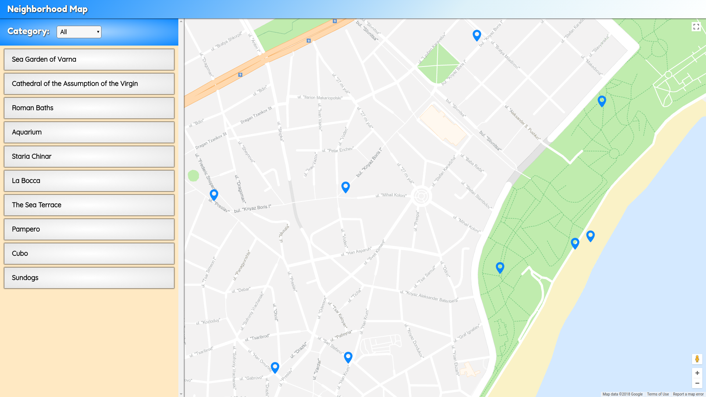

  

# Neighborhood Map Project

This is my submission for [Udacity's Front-End Web Developer Nanodegree](https://www.udacity.com/course/front-end-web-developer-nanodegree--nd001). This is a single page application built on the React framework. The application displays a map of an area using [Google Maps API](https://developers.google.com/maps/documentation/javascript/tutorial) and various points of interest such as sightseeings, restaurants, bars. The user can filter the displayed places by category. When clicking on map marker or listing button, additional information about the place is displayed. This information is provided using [FourSquare API](https://developer.foursquare.com/). All application components render on-screen in a responsive manner. The application meets all the accessibility criteria. The build version of the application uses "offline first technique" to load content from browsers cache, using service worker. Full specification are available here: [Udacity Project Rubric](https://review.udacity.com/#!/rubrics/1351/view)

## How to run the project
You can check the live version [here](https://fullyslick.github.io/Neighborhood-Map/)
or:

The project requires [Node.js](https://nodejs.org/en/) and uses the [Create-React-App](https://github.com/facebook/create-react-app) package.

1. Download or clone the project from repository.

2. Download and install [Node.js](https://nodejs.org/en/download/) (if you do not have it already installed).

3. Navigate to the folder where project is located using **terminal** or **CMD**.

4. Install all project dependencies with `npm install` command.

Run in **Development Mode**:

 - Start the development server with `npm start` command.

 - In your browser go to: [http://localhost:3000/](ttp://localhost:3000/).

NOTE: **In development mode serving the application from cache is not available.**

Run in **Production Mode**:

 - Build the application with `npm run build` command.

 - Follow the instructions in command line.

 - Run `serve -s build` command.

 - In your browser go to: [http://localhost:5000/](ttp://localhost:5000/)

 ### Resources and Documentation:

 * [Google Maps API](https://developers.google.com/maps/documentation/javascript/tutorial)
 * [Google Map React Component](https://www.npmjs.com/package/google-maps-react)
 * [How to Write a Google Maps React Component](https://www.fullstackreact.com/articles/how-to-write-a-google-maps-react-component/)
 * [Create-react-app Documentation](https://github.com/facebookincubator/create-react-app)
 * [React API](https://facebook.github.io/react/docs/react-api.html)
 * [Foursquare API - Venue Search](https://developer.foursquare.com/docs/api/venues/search)
 * [Snazzymaps](https://snazzymaps.com/)

### Requirements

- `Node.js`
- Browser with JavaScript enabled (by default it is enabled on all browsers).

#### License
The content of this repository is licensed under a [Creative Commons Attribution License](https://choosealicense.com/licenses/mit/).
